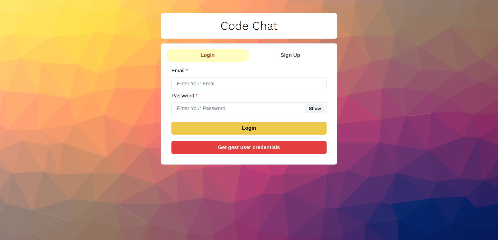
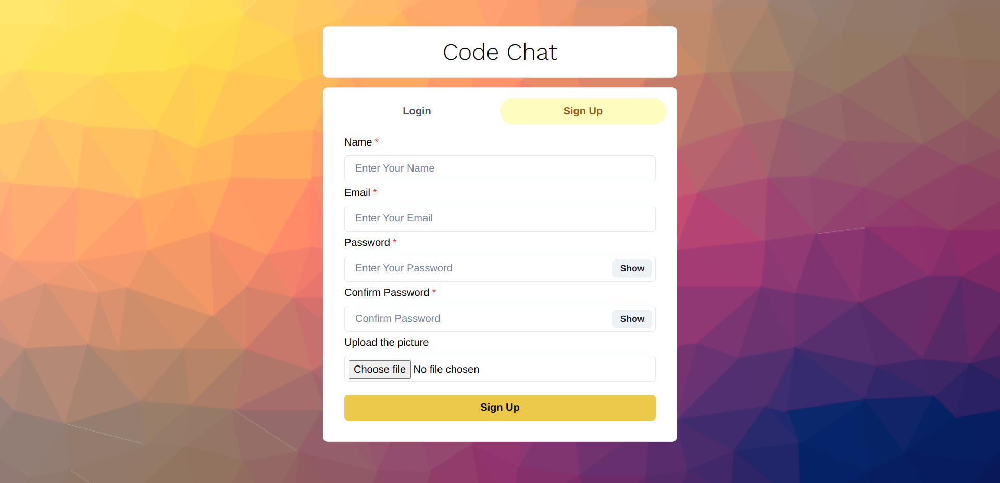
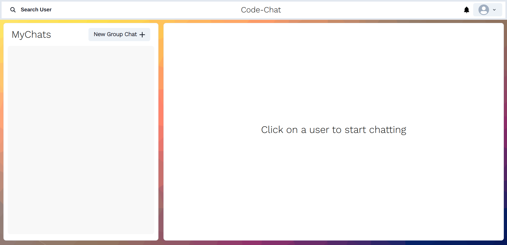
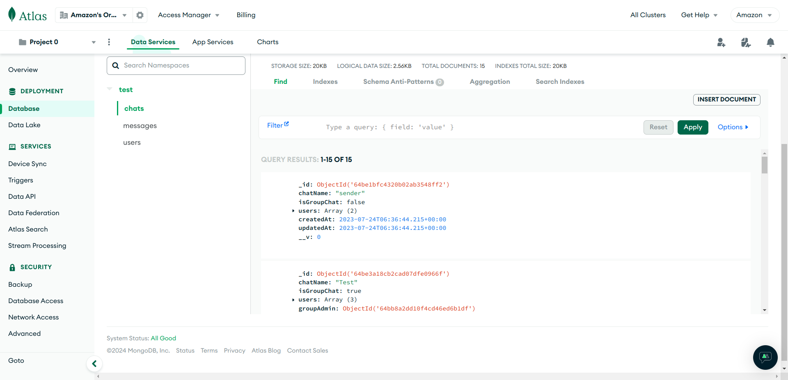
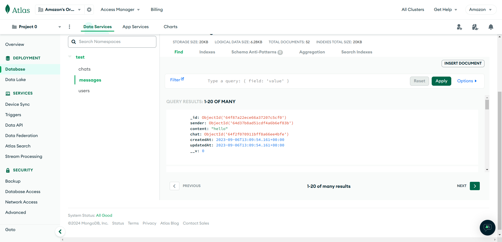
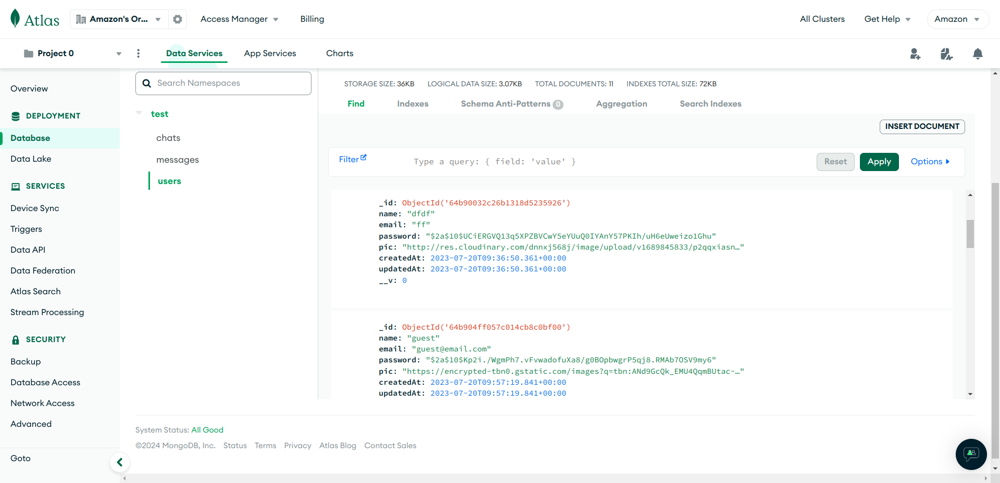

# MERN Chat App with Socket.io
Link to repo [here](https://github.com/NIXBLACK11/chatApp)
## Overview
This MERN (MongoDB, Express.js, React.js, Node.js) Chat App is a real-time messaging application that utilizes the power of Socket.io for seamless communication between users. The app allows users to sign up, log in, and engage in real-time chat conversations.

## Features
- Real-time Chat: Instantly send and receive messages in real-time.
- User Authentication: Secure user authentication and authorization.
- Responsive Design: The application is designed to work seamlessly across various devices.

## Technologies Used
- MongoDB: Database to store user information, chat, and messages.
- Express.js: Backend framework for handling server-side logic.
- React.js: Frontend framework for building a dynamic user interface.
- Node.js: Server-side JavaScript runtime.
- Socket.io: Real-time communication library for enabling bi-directional communication.

## Installation
Clone the repository:

        git clone https://github.com/NIXBLACK11/codeChat.git

## Install dependencies:

        cd codeChat/backend
        npm install

        cd codeChat/frontend
        npm install

## Set up environment variables:

Create a .env file in the root directory and add the following:

        MONGODB_URI=your_mongodb_connection_string

## Run the app:

        frontend
        npm start

        backend
        node server.js

The app will be accessible at http://localhost:3000.

## Screenshots

### Sign In Page

### Sign Up Page

### User Page

### MongoDB Screenshots
- Users Collection

- Chat Collection

- Messages Collection

## Contributing

Feel free to contribute to the project by opening issues or submitting pull requests. Your feedback and contributions are highly appreciated.

